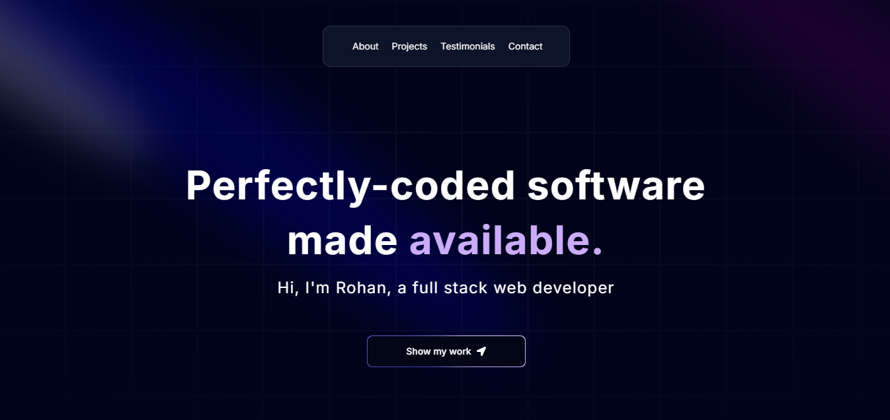

# Rohan's Portfolio




Modern and responsive web Portfolio built with Next.js, TypeScript, and Aceternity UI, designed to highlight skills and projects. It features a clean and intuitive user interface, showcasing my expertise in web development, with a focus on performance, scalability, and design. This portfolio serves as a professional online presence, demonstrating my ability to create sophisticated and efficient web applications.


## 🛠️ Tech Stack

- **Next.js** – Fast, scalable React framework
- **TypeScript** – Type safety for better development
- **Framer Motion** – Smooth animations
- **Three.js** – Interactive 3D elements
- **TailwindCSS** – Utility-first styling
- **Aceternity UI** – Modern UI components

## 🚀 Live Demo

Check out the live demo [here](https://portfolio-rohanbasnet12s-projects.vercel.app/).

## 💡 Setup Instructions

1. Clone the repository:
   ```bash
   git clone https://github.com/your-username/your-repo-name.git

2. Install dependencies:
    ```bash
   npm install

3. Run the development server
    ``` bash
    npm run dev

## Acknowledgements

- [Awesome Readme Templates](https://awesomeopensource.com/project/elangosundar/awesome-README-templates)
- [Awesome README](https://github.com/matiassingers/awesome-readme)
- [How to Write a Good README](https://bulldogjob.com/news/449-how-to-write-a-good-readme-for-your-github-project)
- A big thanks to [JavaScriptMastery](https://www.youtube.com/c/JavaScriptMastery) for their tutorials, which helped me build this project.
- Special thanks to [Aceternity UI](https://aceternity.com) for their amazing UI components that inspired the design of this portfolio.

## Authors

- [@RohanBasnet](https://github.com/Rohanbasnet12)

## Usage/Examples

```javascript
import Component from 'my-project'

function App() {
  return <Component />
}
```

## 🚀 About Me
I'm a full stack developer...

# Hi, I'm Rohan! 👋

## 🔗 Links
[](https://portfolio-rohanbasnet12s-projects.vercel.app/)
[](https://www.linkedin.com/in/rohan-basnet-131841121/)
[](https://x.com/RohanBa52433349)
